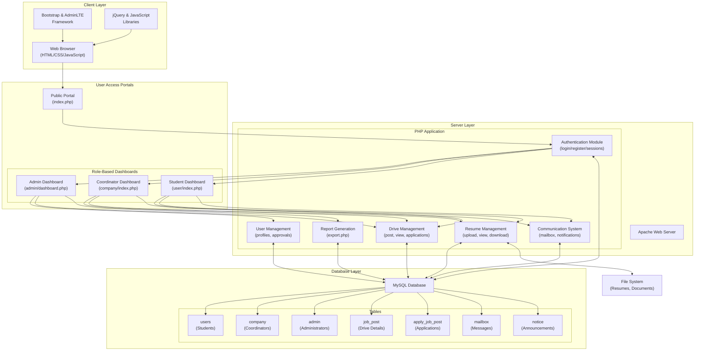

```mermaid
flowchart TD
    %% Client Layer
    subgraph "Client Layer"
        Browser["Web Browser\n(HTML/CSS/JavaScript)"]
        Bootstrap["Bootstrap & AdminLTE\nFramework"]
        JQuery["jQuery & JavaScript\nLibraries"]
    end
    
    %% Server Layer
    subgraph "Server Layer"
        Apache["Apache Web Server"]
        
        subgraph "PHP Application"
            Auth["Authentication Module\n(login/register/sessions)"]
            UserMgmt["User Management\n(profiles, approvals)"]
            DriveMgmt["Drive Management\n(post, view, applications)"]
            CommSystem["Communication System\n(mailbox, notifications)"]
            ResumeMgmt["Resume Management\n(upload, view, download)"]
            ReportGen["Report Generation\n(export.php)"]
        end
    end
    
    %% Database Layer
    subgraph "Database Layer"
        MySQL["MySQL Database"]
        
        subgraph "Tables"
            Users["users\n(Students)"]
            Company["company\n(Coordinators)"]
            Admin["admin\n(Administrators)"]
            JobPost["job_post\n(Drive Details)"]
            ApplyJob["apply_job_post\n(Applications)"]
            Mailbox["mailbox\n(Messages)"]
            Notice["notice\n(Announcements)"]
        end
    end
    
    %% User Access Portals
    subgraph "User Access Portals"
        PublicPortal["Public Portal\n(index.php)"]
        
        subgraph "Role-Based Dashboards"
            AdminDash["Admin Dashboard\n(admin/dashboard.php)"]
            CompanyDash["Coordinator Dashboard\n(company/index.php)"]
            StudentDash["Student Dashboard\n(user/index.php)"]
        end
    end
    
    %% Connections and Data Flow
    Browser --> PublicPortal
    PublicPortal --> Auth
    
    Auth --> AdminDash
    Auth --> CompanyDash
    Auth --> StudentDash
    
    AdminDash --> UserMgmt
    AdminDash --> DriveMgmt
    AdminDash --> ReportGen
    
    CompanyDash --> DriveMgmt
    CompanyDash --> ResumeMgmt
    CompanyDash --> CommSystem
    
    StudentDash --> DriveMgmt
    StudentDash --> ResumeMgmt
    StudentDash --> CommSystem
    
    UserMgmt <--> MySQL
    DriveMgmt <--> MySQL
    CommSystem <--> MySQL
    ResumeMgmt <--> MySQL
    ReportGen <--> MySQL
    Auth <--> MySQL
    
    MySQL --> Users
    MySQL --> Company
    MySQL --> Admin
    MySQL --> JobPost
    MySQL --> ApplyJob
    MySQL --> Mailbox
    MySQL --> Notice
    
    Bootstrap --> Browser
    JQuery --> Browser
    
    %% File System Integration
    FileSystem["File System\n(Resumes, Documents)"]
    ResumeMgmt <--> FileSystem
```
